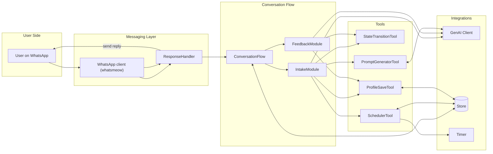
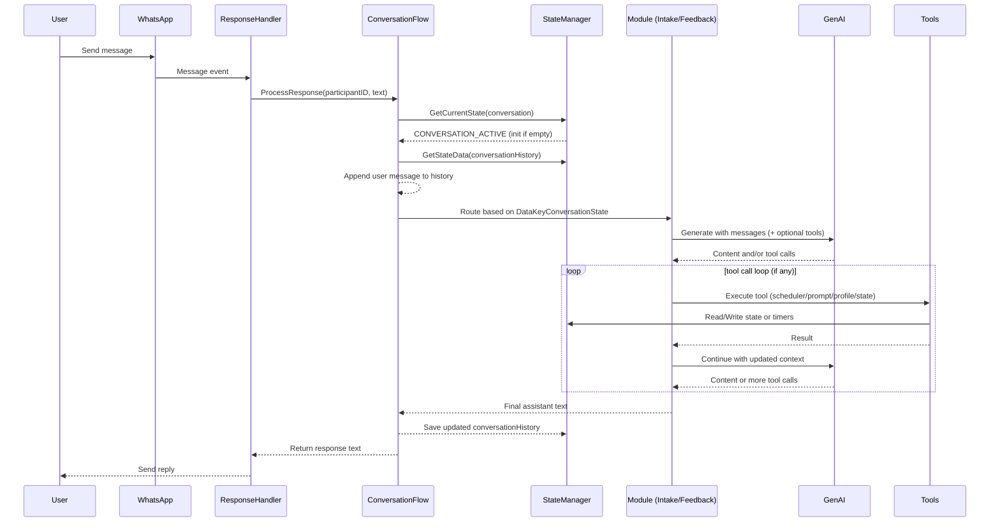
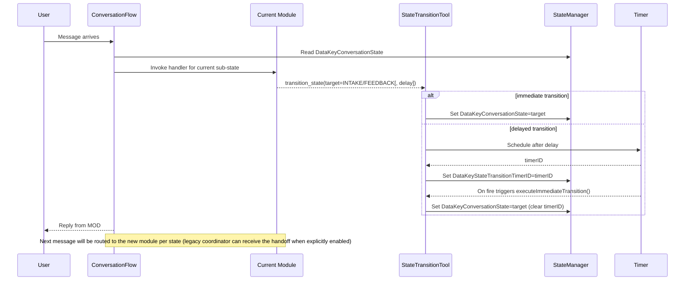

# Conversation Flow Architecture

This document focuses on the Conversation Flow within PromptPipe: what components it uses, how they interact, and how messages move through the system. The broader PromptPipe platform (API, messaging, store, recovery) is referenced as a supporting foundation.

## Scope and goals

- Describe components and modules that power the Conversation Flow
- Show high-level and detailed data/sequence diagrams
- Clarify state model and persistence for conversations
- Explain tool calling (scheduler, prompt generator, profile save, state transition) and side-effects
- Note how the overarching system supports the flow without re-documenting it

## Components overview

Core runtime components used by the Conversation Flow:

- Flow engine: `internal/flow/conversation_flow.go`
- State management: `internal/flow/state_manager.go` (Store-backed)
- Modules (current production wiring):
  - Intake: `internal/flow/intake_module.go`
  - Feedback: `internal/flow/feedback_module.go`
  - (Optional) Coordinator: `internal/flow/coordinator_module.go` / `coordinator_module_static.go`
- Shared tools:
  - SchedulerTool: `internal/flow/scheduler_tool.go` (daily prompts, mechanical reminders, auto-feedback timers)
  - PromptGeneratorTool: `internal/flow/prompt_generator_tool.go`
  - StateTransitionTool: `internal/flow/state_transition_tool.go`
  - ProfileSaveTool: `internal/flow/profile_save_tool.go`
  - Timer: `internal/flow/timer.go`
- GenAI client: `internal/genai/genai.go`
  - Supports structured thinking+content generation (`GenerateThinkingWithMessages`, `GenerateThinkingWithTools`) always-on for agents
- Messaging service + response handler: `internal/messaging/`
- Store backends: `internal/store/`
- Prompts: `prompts/` (system templates for the coordinator, intake bot, and feedback tracker)

Environment toggles relevant to the flow (see `.env`):

- `CHAT_HISTORY_LIMIT` (history sent to tools; -1 for unlimited)
- `INTAKE_BOT_PROMPT_FILE`, `PROMPT_GENERATOR_PROMPT_FILE`, `FEEDBACK_TRACKER_PROMPT_FILE`
- `FEEDBACK_INITIAL_TIMEOUT`, `FEEDBACK_FOLLOWUP_DELAY`, `SCHEDULER_PREP_TIME_MINUTES`

## High-level data flow



The overarching PromptPipe system supports this flow by:

- Providing reliable messaging ingress/egress (whatsmeow + `ResponseHandler`)
- Persisting state and hooks across restarts (Store + Recovery)
- Hosting timers/schedules for deferred or recurring actions (Timer)
- Exposing enrollment and admin APIs (`internal/api/`) that initialize conversation state

## State model and persistence

State types and data keys are defined in `internal/models/flow_types.go`:

- Flow type: `conversation`
- Primary flow state: `CONVERSATION_ACTIVE`
- Conversation sub-state (stored under `DataKeyConversationState`):
  - `INTAKE` (default; profile collection + scheduling)
  - `FEEDBACK` (prompt feedback + follow-ups)
  - `COORDINATOR` (legacy/experimental; not set in production wiring)

Important data keys:

- `conversationHistory` (JSON of `[]ConversationMessage`)
- `participantBackground` (optional context for prompts)
- `systemPrompt` (optional; final prompt text may be loaded per-module)
- `userProfile`, `lastHabitPrompt`, `feedbackState`, timers (`feedbackTimerID`, `feedbackFollowupTimerID`, `autoFeedbackTimerID`), `scheduleRegistry`, `stateTransitionTimerID`
- Daily prompt reminder keys: `lastPromptSentAt`, `dailyPromptPending`, `dailyPromptReminderTimerID`, `dailyPromptReminderSentAt`, `dailyPromptRespondedAt`

Persistence path:

- All state lives under `flow_states` via the Store-backed `StateManager`
- Hooks for routing incoming messages are stored in persistent hooks table so they’re restored on startup
- Timers and schedules are rehydrated by the scheduler/feedback modules through recovery hooks

## Sequence: processing an incoming message



## State transitions and handoffs

A module handoff is driven by the StateTransitionTool writing `DataKeyConversationState` to one of `INTAKE`, `FEEDBACK`, or the legacy `COORDINATOR`. In current production wiring the value defaults to `INTAKE` when empty. Delayed handoffs are scheduled via a timer and stored under `stateTransitionTimerID`.

```mermaid
stateDiagram-v2
    [*] --> INTAKE: Enrollment / default route
    INTAKE --> FEEDBACK: transition_state(FEEDBACK)\n(trigger: prompt delivered or intake follow-up)
    FEEDBACK --> INTAKE: transition_state(INTAKE)\n(reason: feedback processed / next prompt setup)

    note right of INTAKE: Builds userProfile via ProfileSaveTool\nMay schedule prompts; exits via transition_state
    note right of FEEDBACK: Tracks outcomes; may schedule follow-ups\nUses timers for initial/follow-up windows

    state "Optional legacy coordinator" as LEGACY {
        [*] --> COORDINATOR
        COORDINATOR --> INTAKE: transition_state(INTAKE)\n(reason: profile collection)
        INTAKE --> COORDINATOR: transition_state(COORDINATOR)\n(reason: profile sufficient or pause)
        COORDINATOR --> FEEDBACK: transition_state(FEEDBACK)\n(trigger: after sending prompt or user reports outcome)
        FEEDBACK --> COORDINATOR: transition_state(COORDINATOR)\n(reason: feedback processed / timeout)
        note right of COORDINATOR: Experimental routing layer\nNot wired in production
    }
```

Transition mechanics (from code):

- Setter: StateTransitionTool executes `SetStateData(DataKeyConversationState, target)`; for delayed transitions it schedules a timer and stores `stateTransitionTimerID`, then performs the transition on callback and clears the ID.
- Router: `ConversationFlow.processConversationMessage()` reads `DataKeyConversationState` and dispatches to Intake/Feedback handlers (Coordinator only if explicitly configured). Unknown or empty defaults to Intake.
- Cancellation: When scheduling a new delayed transition, any existing `stateTransitionTimerID` is canceled before setting a new one.
- Persistence: History (`conversationHistory`) and `userProfile` remain intact across transitions. Only the sub-state changes.

### Handoff lifecycle (sequence)



Common handoffs:

- Intake → Feedback: Triggered after a habit prompt is delivered or when an intake exchange requests immediate feedback. Feedback collects outcomes and may schedule follow-ups.
- Feedback → Intake: Occurs after feedback has been processed or a follow-up window expires so Intake can resume maintenance or adjust scheduling.
- Optional legacy coordinator → Intake/Feedback: Only when the coordinator module is explicitly wired for experiments; otherwise unused.

## Dynamic architecture overview (end-to-end)

The following sequence shows a typical dynamic arc across modules, tools, timers, and messaging: Intake gathers profile context and schedules prompts, then hands to Feedback to collect outcomes before returning to Intake. The legacy coordinator module can still be slotted in experimentally but is not part of the production loop.

```mermaid
sequenceDiagram
  autonumber
  participant User
  participant WA as WhatsApp
  participant RH as ResponseHandler
  participant CF as ConversationFlow
  participant SM as StateManager
  participant IM as Intake
  participant FM as Feedback
  participant GA as GenAI
  participant PST as ProfileSaveTool
  participant PGT as PromptGeneratorTool
  participant SCH as SchedulerTool
  participant STT as StateTransitionTool
  participant TMR as Timer
  participant MSG as MessagingService

  Note over CF,SM: DataKeyConversationState defaults to INTAKE if empty

  User->>WA: Message
  WA->>RH: Event
  RH->>CF: ProcessResponse(participantID,text)
  CF->>SM: GetCurrentState + GetStateData(conversationState, history)

  alt conversationState == INTAKE
    CF->>IM: handleIntakeToolLoop
    IM->>GA: GenerateThinkingWithTools(history, intake prompt)
    GA-->>IM: Tool call(s)
    IM->>PST: save_user_profile(args)
    PST->>SM: SetStateData(userProfile)
    IM->>SCH: scheduler(action=create, ...)
    SCH->>TMR: Schedule prep timer + recurring daily run
    SCH->>SM: Persist scheduleRegistry, lastPromptSentAt, dailyPromptPending
    SCH-->>IM: Confirmation / tool result message
    IM->>STT: transition_state(target=FEEDBACK[, delay_minutes])
    STT->>SM: Update conversationState (cancel dailyPromptReminderTimerID if the participant has replied; cancel auto-feedback timer when entering FEEDBACK)
    IM-->>CF: Assistant text (prompt or confirmation)
  else conversationState == FEEDBACK
    CF->>FM: handleFeedbackToolLoop
    FM->>GA: GenerateThinkingWithTools(history, feedback prompt)
    GA-->>FM: Tool call(s)
    FM->>PST: save_user_profile(args)
    PST->>SM: Update profile (success counts, barriers, tweaks)
    FM->>SCH: scheduler(action=list/delete/...) (optional follow-up adjustments)
    FM->>STT: transition_state(target=INTAKE)
    STT->>SM: Update conversationState back to INTAKE (clear dailyPromptPending if prompt cycle completed)
    FM-->>CF: Assistant text (personalized feedback)
  end

  CF->>SM: Save updated conversationHistory
  CF-->>RH: Assistant text
  RH-->>User: Send reply

  %% Daily prompt reminder / auto-feedback timers
  SCH->>TMR: Schedule reminder (dailyPromptReminderDelay)
  SCH->>SM: Store dailyPromptReminderTimerID
  Note over CF,SCH: When the participant replies, `handleDailyPromptReply` cancels the reminder and records dailyPromptRespondedAt

  Note over SCH,TMR: Timers continue to fire sending scheduled prompts via MessagingService; reminder timers send a mechanical follow-up if no reply is received before expiry
```

## Module responsibilities (current wiring)

- Intake
  - Default entry point; builds structured `userProfile` over multiple turns
  - Schedules or updates daily prompts via the scheduler tool and can trigger prompt generation when ready
  - Invokes `StateTransitionTool` to hand off to `FEEDBACK` when a prompt has been delivered or follow-up is desired

- Feedback
  - Collects user feedback on delivered prompts; can schedule follow-up reminders or adjust existing schedules
  - Manages initial/follow-up timers (`FEEDBACK_INITIAL_TIMEOUT`, `FEEDBACK_FOLLOWUP_DELAY`) alongside scheduler automation
  - Updates `feedbackState` and may transition back to `INTAKE` for continued intake or maintenance conversations

- Optional Coordinator (legacy)
  - Can be manually wired for experiments requiring an additional LLM-driven routing layer
  - Shares the same tool set as Intake and can still transition between `INTAKE` and `FEEDBACK` via the state transition tool

All modules:

- Load module-specific system prompts from files (see `prompts/`)
- Use the same `GenAI` client and tool schema
- Respect history limits (see `CHAT_HISTORY_LIMIT` handling inside flow)
- Emit structured reasoning ("thinking") internally; when debug mode is enabled, reasoning is sent as separate developer-only messages. There is no toggle to disable reasoning generation to avoid prompt schema drift.

## Tools and side-effects

- SchedulerTool
  - Creates recurring or one-shot schedules (uses `Timer`)
  - Persists schedule metadata (`scheduleRegistry`) and tracks `lastPromptSentAt`
  - Schedules mechanical reminders (`dailyPromptReminderDelay`) and auto-feedback enforcement timers

- PromptGeneratorTool
  - Produces personalized, concise habit prompts; may store `lastHabitPrompt`

- ProfileSaveTool
  - Reads and updates structured `userProfile` in state; helps Intake and Feedback modules make decisions

- StateTransitionTool
  - Writes `DataKeyConversationState` to switch among `INTAKE`, `FEEDBACK`, and legacy `COORDINATOR` when enabled
  - May set delayed transitions using `stateTransitionTimerID`

## Message building and prompts

- Modules prepend their system prompt and participant background/context before history
- Conversation history is serialized as `[]ConversationMessage{ role, content, timestamp }`
- History is trimmed and/or windowed before passing to GenAI and tools to control prompt size

## Contracts and edge cases

Inputs:

- Participant message text (from WhatsApp)
- Optional prior `conversationHistory` and `participantBackground`

Outputs:

- Assistant reply text to user
- Optional tool side-effects: schedules created, profile saved, state transitions, timers

Error modes and handling:

- Missing module prompt file: fall back to a default in code and continue
- Store errors while saving history: log warning, still return reply to user
- No tools available: degrade to plain `GenerateWithMessages`
- Invalid state: route through Intake as the safe default (Coordinator only when explicitly wired)

Edge cases:

- First message for a new participant (no state): initialize `CONVERSATION_ACTIVE` and history
- Tool-call loops with no progress: bounded by LLM/tool call orchestration in modules
- Oversized history: trimmed/limited window before LLM call

## How the wider system supports this flow

- API layer (`internal/api/`)
  - Enrollment endpoints initialize participant records and set up hooks/state
- Messaging layer (`internal/messaging/`)
  - Canonicalizes phone numbers; registers persistent hooks; dispatches to the flow
- Store layer (`internal/store/`)
  - Persists `flow_states`, participants, and hook registry; supports SQLite/PostgreSQL
- Recovery subsystem (`internal/recovery/`)
  - Restores hooks and timers after restarts; the flow resumes seamlessly

## File pointers and references

- Flow entry: `internal/flow/conversation_flow.go`
- State interfaces/impl: `internal/flow/state.go`, `internal/flow/state_manager.go`
- State and keys: `internal/models/flow_types.go`
- Modules: `internal/flow/coordinator_module.go`, `internal/flow/intake_module.go`, `internal/flow/feedback_module.go`
- Tools: `internal/flow/scheduler_tool.go`, `internal/flow/prompt_generator_tool.go`, `internal/flow/state_transition_tool.go`, `internal/flow/profile_save_tool.go`, `internal/flow/timer.go`
- Prompts: `prompts/conversation_system_3bot.txt`, `prompts/intake_bot_system.txt`, `prompts/prompt_generator_system.txt`, `prompts/feedback_tracker_system.txt`

---

This architecture reference is intentionally focused on the Conversation Flow. For platform setup, deployment, and non-conversational features, see the Beginner’s Guide and other docs in `docs/`.
