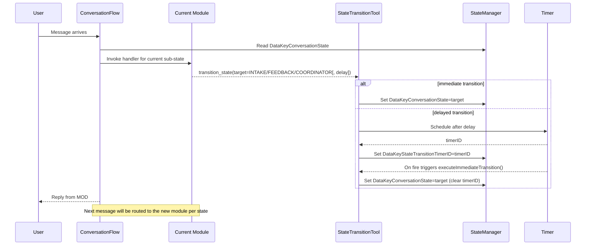
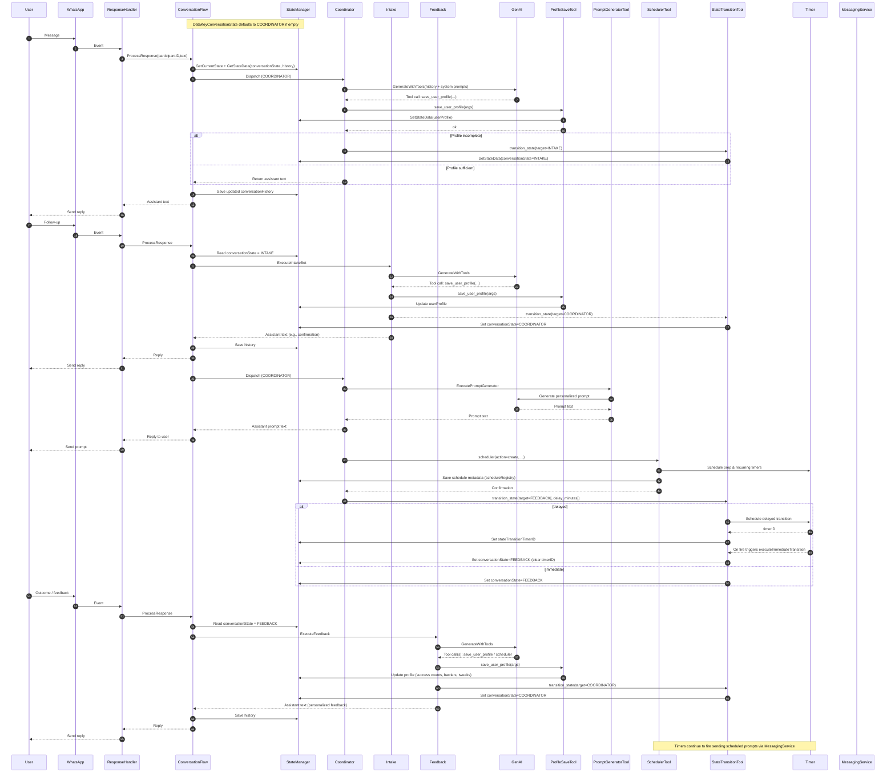

# Conversation Flow Architecture

This document focuses on the Conversation Flow within PromptPipe: what components it uses, how they interact, and how messages move through the system. The broader PromptPipe platform (API, messaging, store, recovery) is referenced as a supporting foundation.

## Scope and goals

- Describe components and modules that power the Conversation Flow
- Show high-level and detailed data/sequence diagrams
- Clarify state model and persistence for conversations
- Explain tool calling (scheduler, prompt generator, profile save, state transition) and side-effects
- Note how the overarching system supports the flow without re-documenting it

## Components overview

Core runtime components used by the Conversation Flow:

- Flow engine: `internal/flow/conversation_flow.go`
- State management: `internal/flow/state_manager.go` (Store-backed)
- Modules (3-bot architecture):
  - Coordinator: `internal/flow/coordinator_module.go`
  - Intake: `internal/flow/intake_module.go`
  - Feedback: `internal/flow/feedback_module.go`
- Shared tools:
  - SchedulerTool: `internal/flow/scheduler_tool.go`
  - PromptGeneratorTool: `internal/flow/prompt_generator_tool.go`
  - StateTransitionTool: `internal/flow/state_transition_tool.go`
  - ProfileSaveTool: `internal/flow/profile_save_tool.go`
  - Timer: `internal/flow/timer.go`
- GenAI client: `internal/genai/genai.go`
- Messaging service + response handler: `internal/messaging/`
- Store backends: `internal/store/`
- Prompts: `prompts/` (system templates for the coordinator, intake bot, and feedback tracker)

Environment toggles relevant to the flow (see `.env`):

- `CHAT_HISTORY_LIMIT` (history sent to tools; -1 for unlimited)
- `INTAKE_BOT_PROMPT_FILE`, `PROMPT_GENERATOR_PROMPT_FILE`, `FEEDBACK_TRACKER_PROMPT_FILE`
- `FEEDBACK_INITIAL_TIMEOUT`, `FEEDBACK_FOLLOWUP_DELAY`, `SCHEDULER_PREP_TIME_MINUTES`

## High-level data flow


The overarching PromptPipe system supports this flow by:

- Providing reliable messaging ingress/egress (whatsmeow + `ResponseHandler`)
- Persisting state and hooks across restarts (Store + Recovery)
- Hosting timers/schedules for deferred or recurring actions (Timer)
- Exposing enrollment and admin APIs (`internal/api/`) that initialize conversation state

## State model and persistence

State types and data keys are defined in `internal/models/flow_types.go`:

- Flow type: `conversation`
- Primary flow state: `CONVERSATION_ACTIVE`
- Conversation sub-state (stored under `DataKeyConversationState`):
  - `COORDINATOR` (default router)
  - `INTAKE` (profile collection)
  - `FEEDBACK` (prompt feedback + follow-ups)

Important data keys:

- `conversationHistory` (JSON of `[]ConversationMessage`)
- `participantBackground` (optional context for prompts)
- `systemPrompt` (optional; final prompt text may be loaded per-module)
- `userProfile`, `lastHabitPrompt`, `feedbackState`, timers (`feedbackTimerID`, `feedbackFollowupTimerID`), `scheduleRegistry`, `stateTransitionTimerID`

Persistence path:

- All state lives under `flow_states` via the Store-backed `StateManager`
- Hooks for routing incoming messages are stored in persistent hooks table so they’re restored on startup
- Timers and schedules are rehydrated by the scheduler/feedback modules through recovery hooks

## Sequence: processing an incoming message


## State transitions and handoffs

A module handoff is driven by the StateTransitionTool writing `DataKeyConversationState` to one of `COORDINATOR`, `INTAKE`, or `FEEDBACK`. The default when empty is `COORDINATOR`. Delayed handoffs are scheduled via a timer and stored under `stateTransitionTimerID`.

```mermaid
stateDiagram-v2
    [*] --> COORDINATOR: Enrollment / no sub-state
    COORDINATOR --> INTAKE: transition_state(INTAKE)\n(reason: profile collection)
    INTAKE --> COORDINATOR: transition_state(COORDINATOR)\n(reason: profile sufficient or pause)
    COORDINATOR --> FEEDBACK: transition_state(FEEDBACK)\n(trigger: after sending prompt or user reports outcome)
    INTAKE --> FEEDBACK: transition_state(FEEDBACK)\n(trigger: immediate feedback on a starter prompt)
    FEEDBACK --> COORDINATOR: transition_state(COORDINATOR)\n(reason: feedback processed / timeout)

    note right of COORDINATOR: Can call tools (save profile, generate prompt, scheduler)\nCan schedule delayed transitions (minutes)
    note right of INTAKE: Builds userProfile via ProfileSaveTool\nMay schedule prompts; exits via transition_state
    note right of FEEDBACK: Tracks outcomes; may schedule follow-ups\nUses timers for initial/ follow-up windows
```

Transition mechanics (from code):

- Setter: StateTransitionTool executes `SetStateData(DataKeyConversationState, target)`; for delayed transitions it schedules a timer and stores `stateTransitionTimerID`, then performs the transition on callback and clears the ID.
- Router: `ConversationFlow.processConversationMessage()` reads `DataKeyConversationState` and dispatches to Coordinator/Intake/Feedback handlers. Unknown or empty defaults to Coordinator.
- Cancellation: When scheduling a new delayed transition, any existing `stateTransitionTimerID` is canceled before setting a new one.
- Persistence: History (`conversationHistory`) and `userProfile` remain intact across transitions. Only the sub-state changes.

### Handoff lifecycle (sequence)



Common handoffs:

- Coordinator → Intake: When the model determines profile info is needed; Intake collects and saves via ProfileSaveTool, then transitions back.
- Coordinator/Intake → Feedback: After a prompt is sent and the user reports an outcome (or when the model decides to gather outcomes), Feedback tracks results and updates profile.
- Feedback → Coordinator: After processing feedback or after a timeout/follow-up window, return to Coordinator.

## Dynamic architecture overview (end-to-end)

The following sequence shows a typical dynamic arc across modules, tools, timers, and messaging: Coordinator bootstraps, hands off to Intake for profile building, returns to Coordinator to generate/schedule prompts, then hands to Feedback to process outcomes, finally returning to Coordinator.



## Module responsibilities (3-bot model)

- Coordinator
  - Default entry point and fallback router
  - May call tools to save profile snippets, generate prompts, schedule reminders
  - Uses `StateTransitionTool` to enter `INTAKE` or `FEEDBACK`

- Intake
  - Builds structured `userProfile` over multiple turns
  - Can schedule initial prompts or generate tailored prompts while collecting profile info
  - Uses `StateTransitionTool` to return to Coordinator after profile completeness criteria

- Feedback
  - Collects user feedback on delivered prompts; can schedule follow-up reminders
  - Manages initial/follow-up timers (`FEEDBACK_INITIAL_TIMEOUT`, `FEEDBACK_FOLLOWUP_DELAY`)
  - Updates `feedbackState`, may adjust next prompt generation

All modules:

- Load module-specific system prompts from files (see `prompts/`)
- Use the same `GenAI` client and tool schema
- Respect history limits (see `CHAT_HISTORY_LIMIT` handling inside flow)

## Tools and side-effects

- SchedulerTool
  - Creates recurring or one-shot schedules (uses `Timer`)
  - Persists schedule metadata in `scheduleRegistry` and coordinates sending via Messaging

- PromptGeneratorTool
  - Produces personalized, concise habit prompts; may store `lastHabitPrompt`

- ProfileSaveTool
  - Reads and updates structured `userProfile` in state; helps Coordinator/Intake make decisions

- StateTransitionTool
  - Writes `DataKeyConversationState` to switch among `COORDINATOR`, `INTAKE`, `FEEDBACK`
  - May set delayed transitions using `stateTransitionTimerID`

## Message building and prompts

- Modules prepend their system prompt and participant background/context before history
- Conversation history is serialized as `[]ConversationMessage{ role, content, timestamp }`
- History is trimmed and/or windowed before passing to GenAI and tools to control prompt size

## Contracts and edge cases

Inputs:

- Participant message text (from WhatsApp)
- Optional prior `conversationHistory` and `participantBackground`

Outputs:

- Assistant reply text to user
- Optional tool side-effects: schedules created, profile saved, state transitions, timers

Error modes and handling:

- Missing module prompt file: fall back to a default in code and continue
- Store errors while saving history: log warning, still return reply to user
- No tools available: degrade to plain `GenerateWithMessages`
- Invalid state: route through Coordinator as safe default

Edge cases:

- First message for a new participant (no state): initialize `CONVERSATION_ACTIVE` and history
- Tool-call loops with no progress: bounded by LLM/tool call orchestration in modules
- Oversized history: trimmed/limited window before LLM call

## How the wider system supports this flow

- API layer (`internal/api/`)
  - Enrollment endpoints initialize participant records and set up hooks/state
- Messaging layer (`internal/messaging/`)
  - Canonicalizes phone numbers; registers persistent hooks; dispatches to the flow
- Store layer (`internal/store/`)
  - Persists `flow_states`, participants, and hook registry; supports SQLite/PostgreSQL
- Recovery subsystem (`internal/recovery/`)
  - Restores hooks and timers after restarts; the flow resumes seamlessly

## File pointers and references

- Flow entry: `internal/flow/conversation_flow.go`
- State interfaces/impl: `internal/flow/state.go`, `internal/flow/state_manager.go`
- State and keys: `internal/models/flow_types.go`
- Modules: `internal/flow/coordinator_module.go`, `internal/flow/intake_module.go`, `internal/flow/feedback_module.go`
- Tools: `internal/flow/scheduler_tool.go`, `internal/flow/prompt_generator_tool.go`, `internal/flow/state_transition_tool.go`, `internal/flow/profile_save_tool.go`, `internal/flow/timer.go`
- Prompts: `prompts/conversation_system_3bot.txt`, `prompts/intake_bot_system.txt`, `prompts/prompt_generator_system.txt`, `prompts/feedback_tracker_system.txt`

---

This architecture reference is intentionally focused on the Conversation Flow. For platform setup, deployment, and non-conversational features, see the Beginner’s Guide and other docs in `docs/`.
